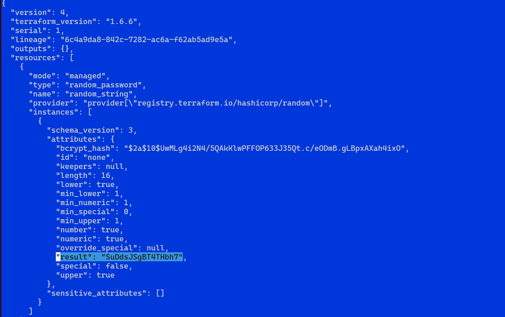
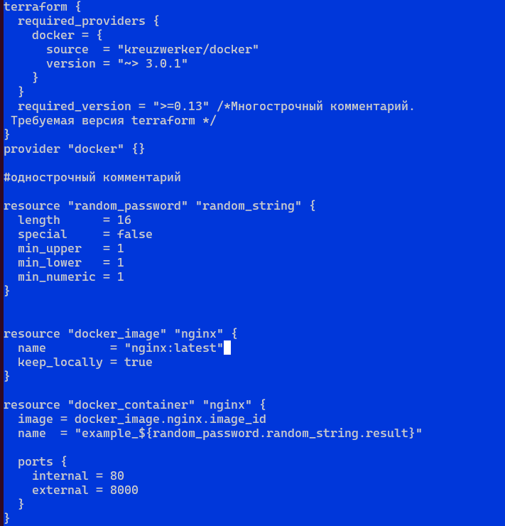
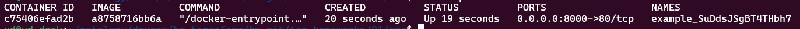
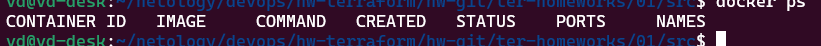
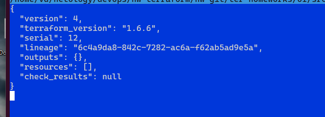

# Домашнее задание к занятию «Введение в Terraform»

------

### Задание 1

2. Изучите файл .gitignore. В каком terraform-файле, согласно этому .gitignore, допустимо сохранить личную, секретную информацию?

```
personal.auto.tfvars
```

3. Выполните код проекта. Найдите в state-файле секретное содержимое созданного ресурса random_password, пришлите в качестве ответа конкретный ключ и его значение.



4. Раскомментируйте блок кода, примерно расположенный на строчках 29–42 файла main.tf. Выполните команду terraform validate. Объясните, в чём заключаются намеренно допущенные ошибки. Исправьте их.

_- Ошибка строка 24: отсутствует имя ресурса_

_- Ошибка строка 29: неправильное имя ресурса. Имя ресурса не может начинаться с цифры_

_- Ошибка строка 31: ссылка на неизвестный ресурс-".random_string_FAKE.resulT"_ 

5. Выполните код. В качестве ответа приложите: исправленный фрагмент кода и вывод команды docker ps.





6. Замените имя docker-контейнера в блоке кода на hello_world. Не перепутайте имя контейнера и имя образа. Мы всё ещё продолжаем использовать name = "nginx:latest". Выполните команду terraform apply -auto-approve. Объясните своими словами, в чём может быть опасность применения ключа -auto-approve. Догадайтесь или нагуглите зачем может пригодиться данный ключ? В качестве ответа дополнительно приложите вывод команды docker ps.

_Опасность применения -auto-approve заключается в том, что нет возможности ознакомиться с измениями в инфастуктуре которые сделает terraform, вовремя заметиь ошибку и отказаться от неправильных действий._



7. Уничтожьте созданные ресурсы с помощью terraform. Убедитесь, что все ресурсы удалены. Приложите содержимое файла terraform.tfstate.



8. Объясните, почему при этом не был удалён docker-образ nginx:latest. Ответ обязательно подкрепите строчкой из документации terraform провайдера docker. (ищите в классификаторе resource docker_image )

_docker-образ не удален т.к. keep_locally = true._

> keep_locally (Boolean) If true, then the Docker image won't be deleted on destroy operation. If this is false, it will delete the image from the docker local storage on destroy operation.
------


